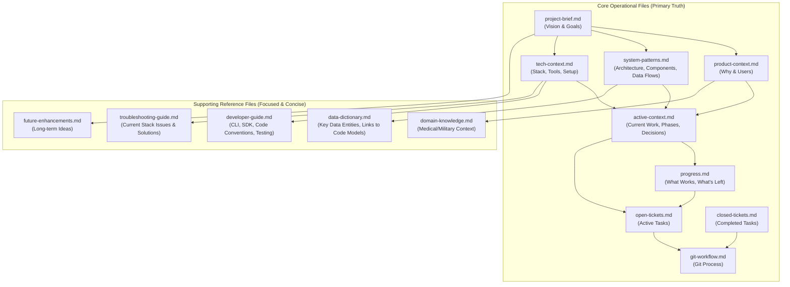

# Cline's Memory Bank Guide

This Memory Bank is crucial for Cline's operation, providing all necessary context after a memory reset. It's designed to be accurate, concise, and maintainable.

## Guiding Principles

1.  **Source of Truth**: Files should reflect the current state of the project.
2.  **Minimize Redundancy**: Avoid duplicating information. Refer to code or other documents where appropriate.
3.  **Clarity and Focus**: Each document has a specific purpose.
4.  **Maintainability**: A streamlined structure is easier to keep up-to-date.

## Core File Structure

The Memory Bank is organized into **Core Operational Files** (must always be current) and **Supporting Reference Files** (updated as needed).

### Core Operational Files

These files are the primary source of truth and must be kept meticulously up-to-date.

1.  **`project-brief.md`**:
    *   **Purpose**: The foundational document outlining the project's vision, core requirements, and overarching goals.
    *   **Source for**: Understanding the fundamental objectives of the project.

2.  **`product-context.md`**:
    *   **Purpose**: Explains *why* the project exists, the problems it solves, target users, and user experience goals.
    *   **Source for**: Understanding the user-centric aspects and the project's value proposition.

3.  **`active-context.md`**:
    *   **Purpose**: Details the current work focus, phase plan, recent changes, active decisions, and immediate challenges.
    *   **Source for**: **Cline's primary guide for "what to do now" and the immediate project state.**

4.  **`system-patterns.md`**:
    *   **Purpose**: Describes the high-level system architecture, key component interactions, data flows, and significant design patterns *currently in use*.
    *   **Source for**: **Cline's primary guide for "how the system is built."**

5.  **`tech-context.md`**:
    *   **Purpose**: Outlines the technology stack, development environment setup, tools, file structure overview, and key library usage.
    *   **Source for**: **Cline's primary guide for "what tools and technologies to use."**

6.  **`progress.md`**:
    *   **Purpose**: Summarizes what currently works, what's left to build, and known issues. Largely derived from `active-context.md`.
    *   **Source for**: A quick overview of project status and completeness.

7.  **`open-tickets.md`**:
    *   **Purpose**: Tracks all active development tasks, features, bugs, and technical debt items.
    *   **Source for**: Specific, actionable work items.

8.  **`closed-tickets.md`**:
    *   **Purpose**: A record of completed tickets, their resolution, and lessons learned.
    *   **Source for**: Historical context on past work.

9.  **`git-workflow.md`**:
    *   **Purpose**: Defines the Git branching strategy, commit conventions, and Pull Request (PR) process.
    *   **Source for**: How to manage code changes and contributions.

### Supporting Reference Files

These files provide more detailed information on specific topics and should be updated as needed. They aim to be concise and focused.

1.  **`data-dictionary.md`** (Replaces `data-structures.md`):
    *   **Purpose**: Describes key data entities (e.g., Patient, ConfigurationScenario), their purpose, and high-level relationships. **Crucially, for detailed structures, it refers to the source code (Pydantic models in `patient_generator/schemas_config.py`, API models in `app.py`, SQLAlchemy models in `patient_generator/models_db.py`) rather than duplicating them.** May include high-level diagrams of data flow or entity relationships.
    *   **Source for**: Understanding the main data concepts and where to find their precise definitions.

2.  **`developer-guide.md`** (Consolidates essential, current parts of `cli-commands.md` and `code-patterns.md`):
    *   **Purpose**: A practical guide for developers working on the project. Covers:
        *   Key CLI commands for development (e.g., `./start-dev.sh`, `npm run ...`, `docker compose ...`, `alembic ...`).
        *   How to use the Python SDK (`patient_generator_sdk.py`).
        *   Core coding patterns and conventions specific to *this* project's current stack (FastAPI, Pydantic, React, etc.).
        *   Instructions on how to run tests.
    *   **Source for**: Practical "how-to" information for development tasks.

3.  **`troubleshooting-guide.md`** (Replaces `common-issues.md`):
    *   **Purpose**: Lists common problems, error messages, and their solutions relevant to the *current* technology stack and architecture.
    *   **Source for**: Resolving frequent issues encountered during development or operation.

4.  **`domain-knowledge.md`** (Replaces `medical-military-context.md`):
    *   **Purpose**: Provides essential background on medical and military concepts relevant to the project (e.g., NATO medical roles, patient flow, medical coding standards). Updated to reflect that distributions are now configurable.
    *   **Source for**: Understanding the domain-specific context and terminology.

5.  **`future-enhancements.md`** (Replaces `enhancement-opportunities.md`):
    *   **Purpose**: A curated list of potential future ideas and improvements, distinct from active tickets in `open-tickets.md`.
    *   **Source for**: Long-term vision and potential evolution of the project.

## Deprecated Files (Content absorbed or no longer primary memory bank material)

The following files from the previous structure are considered deprecated in their old form. Their relevant, up-to-date information has been integrated into the new structure, or they are no longer considered primary Memory Bank material:

*   `component-reference.md`: Key component information is now within `system-patterns.md` and `tech-context.md`.
*   `workflows-processes.md`: Current, relevant workflows are described in `system-patterns.md` (Data Flow) and `active-context.md`.
*   `best-practices.md`: This contained generic AI assistant guidelines, not project-specific memory. Project-specific best practices are in `git-workflow.md`, `.clinerules`, and the new `developer-guide.md`.
*   The old versions of `data-structures.md`, `cli-commands.md`, `code-patterns.md`, `common-issues.md`, `medical-military-context.md`, and `enhancement-opportunities.md` are superseded by their new counterparts or consolidated files.

This revised structure aims to make the Memory Bank a more effective tool for Cline.
