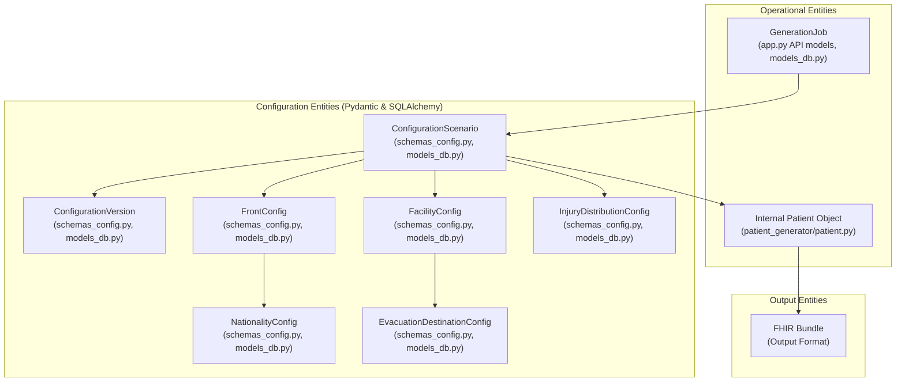

# Data Dictionary

This document describes the key data entities used within the Military Medical Exercise Patient Generator. For precise, up-to-date definitions of these structures, **always refer to the source code**, primarily the Pydantic models in `patient_generator/schemas_config.py` and `app.py` (for API request/response models), and the SQLAlchemy models in `patient_generator/models_db.py` (for database persistence).

## Core Data Entities

### 1. ConfigurationScenario

*   **Purpose**: Represents a complete, user-defined scenario for patient generation. This is the central configuration object that drives the entire generation process. It encapsulates all parameters defining how patients are generated, their medical conditions, and their flow through facilities.
*   **Key Attributes (High-Level)**:
    *   Scenario name, description, version.
    *   Overall patient generation parameters (total count, base date).
    *   A list of `FrontConfig` objects defining different fronts.
    *   A list of `FacilityConfig` objects defining the medical facility chain.
    *   An `InjuryDistributionConfig` object defining overall injury patterns.
    *   Output format and security settings.
*   **Source Code Reference**:
    *   Pydantic Schema: `patient_generator.schemas_config.ConfigurationScenarioCreate`, `patient_generator.schemas_config.ConfigurationScenarioOut`
    *   SQLAlchemy Model: `patient_generator.models_db.ConfigurationTemplate` (and related tables for nested structures)

### 2. ConfigurationVersion

*   **Purpose**: Represents a specific version of a `ConfigurationScenario`. Allows for tracking changes and reverting to previous settings.
*   **Key Attributes (High-Level)**:
    *   Version number, parent configuration ID (for lineage).
    *   Timestamp of creation/update.
    *   The actual configuration data (often embedded or linked to the main `ConfigurationScenario` data).
*   **Source Code Reference**:
    *   Pydantic Schema: Attributes within `ConfigurationScenarioOut` and related update schemas.
    *   SQLAlchemy Model: `version` and `parent_config_id` fields in `patient_generator.models_db.ConfigurationTemplate`.

### 3. FrontConfig

*   **Purpose**: Defines a specific "front" or operational area from which casualties originate.
*   **Key Attributes (High-Level)**:
    *   Front name.
    *   Percentage of total casualties originating from this front.
    *   A list of `NationalityConfig` objects defining the mix of nationalities present on this front.
    *   Casualty start and end day/time parameters.
*   **Source Code Reference**:
    *   Pydantic Schema: `patient_generator.schemas_config.FrontConfigCreate`, `patient_generator.schemas_config.FrontConfigOut`
    *   SQLAlchemy Model: `patient_generator.models_db.FrontConfig`

### 4. FacilityConfig

*   **Purpose**: Defines a specific medical treatment facility within the evacuation chain.
*   **Key Attributes (High-Level)**:
    *   Facility ID/name (e.g., "R1", "R2_Light").
    *   Facility type/role.
    *   A list of `EvacuationDestinationConfig` objects defining probabilities of patients moving to subsequent facilities, returning to duty (RTD), or becoming killed in action (KIA).
    *   Treatment parameters specific to this facility.
*   **Source Code Reference**:
    *   Pydantic Schema: `patient_generator.schemas_config.FacilityConfigCreate`, `patient_generator.schemas_config.FacilityConfigOut`
    *   SQLAlchemy Model: `patient_generator.models_db.FacilityConfig`

### 5. NationalityConfig (within FrontConfig)

*   **Purpose**: Defines the presence and proportion of a specific nationality on a given front.
*   **Key Attributes (High-Level)**:
    *   Nationality code (e.g., "USA", "POL").
    *   Percentage of casualties from this nationality on the parent front.
*   **Source Code Reference**:
    *   Pydantic Schema: `patient_generator.schemas_config.NationalityInFrontCreate`, `patient_generator.schemas_config.NationalityInFrontOut`
    *   SQLAlchemy Model: `patient_generator.models_db.NationalityInFront`

### 6. InjuryDistributionConfig

*   **Purpose**: Defines the overall distribution of major injury categories (e.g., Battle Injury, Disease, Non-Battle Injury) for the entire scenario.
*   **Key Attributes (High-Level)**:
    *   Percentages for each major injury category.
    *   Potentially more granular sub-distributions.
*   **Source Code Reference**:
    *   Pydantic Schema: `patient_generator.schemas_config.InjuryDistributionCreate`, `patient_generator.schemas_config.InjuryDistributionOut`
    *   SQLAlchemy Model: `patient_generator.models_db.InjuryDistribution`

### 7. EvacuationDestinationConfig (within FacilityConfig)

*   **Purpose**: Defines the probability of a patient moving from a parent facility to a specific destination (another facility, RTD, KIA).
*   **Key Attributes (High-Level)**:
    *   Destination ID (e.g., "R2_Enhanced", "RTD", "KIA").
    *   Probability percentage.
    *   Conditioning factors (e.g., based on injury type or triage category).
*   **Source Code Reference**:
    *   Pydantic Schema: `patient_generator.schemas_config.EvacuationDestinationCreate`, `patient_generator.schemas_config.EvacuationDestinationOut`
    *   SQLAlchemy Model: `patient_generator.models_db.EvacuationDestination`

### 8. Internal Patient Object

*   **Purpose**: The in-memory representation of a patient during the generation process, before being formatted into FHIR or other outputs.
*   **Key Attributes (High-Level)**:
    *   Unique ID, demographics, assigned nationality, front, injury type, triage category.
    *   Primary medical condition, additional conditions, allergies, medications.
    *   A detailed treatment history, tracking movement through facilities and treatments received.
    *   Current status (e.g., at R2, RTD, KIA).
*   **Source Code Reference**:
    *   Class Definition: `patient_generator.patient.Patient`

### 9. GenerationJob

*   **Purpose**: Represents a patient generation task initiated by a user. Stores metadata about the job, its status, and links to its results.
*   **Key Attributes (High-Level)**:
    *   Job ID, status (queued, running, completed, failed), progress percentage.
    *   Timestamp of creation and completion.
    *   The `configuration_id` used for the generation.
    *   Summary statistics of the generated data.
    *   Paths or references to the output files.
*   **Source Code Reference**:
    *   API Models: Defined in `app.py` (e.g., `JobStatusResponse`).
    *   SQLAlchemy Model: `patient_generator.models_db.Job`

### 10. FHIR Bundle (Output Format)

*   **Purpose**: The primary medical data output format, adhering to the HL7 FHIR R4 standard. Each bundle typically represents one patient and contains all their relevant medical information as a collection of FHIR resources.
*   **Key FHIR Resources within a Bundle**:
    *   `Patient`: Demographics, identifiers.
    *   `Condition`: Medical diagnoses.
    *   `Procedure`: Treatments performed.
    *   `Observation`: Vital signs, lab results.
    *   `Encounter`: (Potentially) To represent stays at facilities.
    *   `MedicationRequest` / `MedicationAdministration`: (Potentially) For medications.
*   **Source Code Reference**:
    *   Generation Logic: `patient_generator.fhir_generator.FHIRBundleGenerator`
    *   Standard Reference: [HL7 FHIR R4 Specification](https://www.hl7.org/fhir/R4/)

## Data Flow Highlights

1.  **Configuration Creation/Selection**: User defines a `ConfigurationScenario` via UI/API, which is stored in PostgreSQL.
2.  **Job Initiation**: A `GenerationJob` is created, referencing a `ConfigurationScenario`.
3.  **Generation Process**:
    *   `ConfigurationManager` loads the `ConfigurationScenario`.
    *   `PatientGeneratorApp` uses this configuration to drive the creation of `Internal Patient Objects`.
    *   `FHIRBundleGenerator` transforms `Internal Patient Objects` into `FHIR Bundles`.
4.  **Output**: `FHIR Bundles` (and other formats) are written to files, and the `GenerationJob` record is updated with status and results.

This dictionary provides a high-level overview. For the most accurate and detailed structure definitions, always consult the Pydantic and SQLAlchemy models in the codebase.
