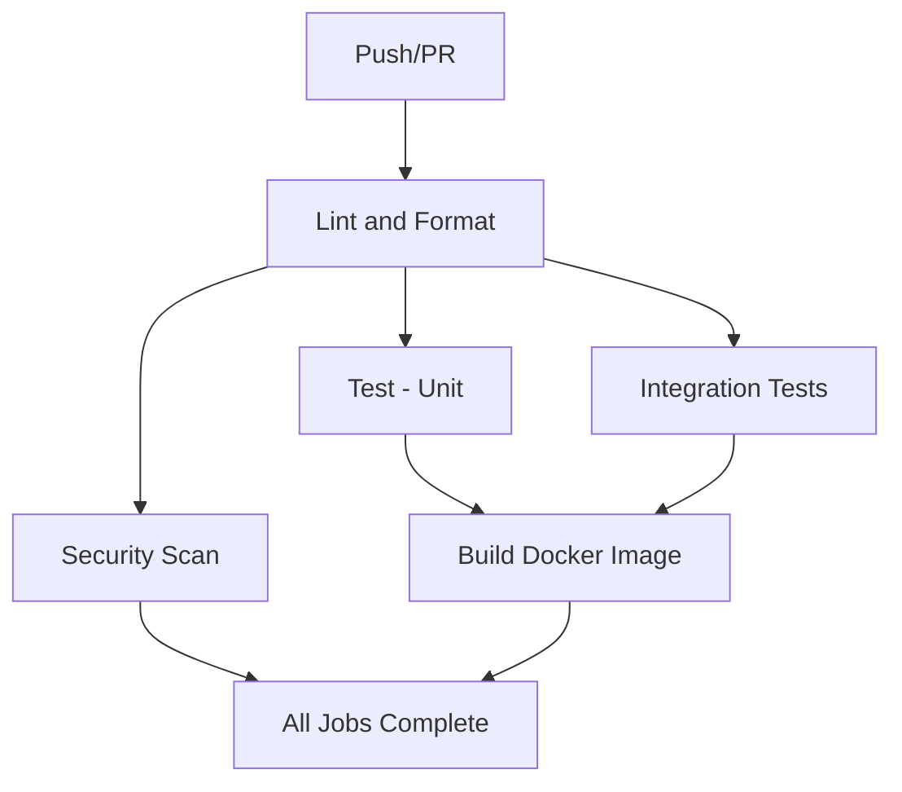

# CI Requirements Matrix - Medical Patients Generator

## Complete Test Matrix for PR Approval

Every PR must pass **ALL 5 CI jobs** before merge. This document provides the exact requirements and failure patterns.

## Required CI Jobs Matrix

| Job Name | Duration | Tests Count | Key Validations | Failure Patterns |
|----------|----------|-------------|-----------------|-------------------|
| **Lint and Format** | ~20s | N/A | Code quality, type safety | Import errors, style violations |
| **Test** | ~50s | 43 unit tests | Core logic, mocks, fast feedback | Logic errors, API changes |
| **Integration Tests** | ~1m | 21 integration tests | Real API, database, auth | API contract violations |
| **Security Scan** | ~15s | N/A | Vulnerability detection | Dependency vulnerabilities |
| **Build Docker Image** | ~1m20s | N/A | Container buildability | Missing files, dependency issues |

## Detailed Requirements by Job

### 1. Lint and Format Job ✅

**Purpose**: Code quality and consistency
**Command**: 
```bash
ruff check src/ patient_generator/
mypy src/ patient_generator/ --ignore-missing-imports
npm run lint:check
npm run format:check
```

**Must Pass**:
- Python linting (ruff) - no violations
- Type checking (mypy) - all types valid
- JavaScript/TypeScript linting (ESLint)
- Code formatting (Prettier)

**Common Failures**:
- Import errors after file moves
- Type annotation issues
- Unused imports or variables
- Formatting inconsistencies

**Fix Commands**:
```bash
ruff check --fix src/ patient_generator/
npm run format
```

### 2. Test Job (Unit Tests) ✅

**Purpose**: Fast feedback on core logic
**Command**: `pytest tests/ -v -m "not integration and not e2e"`
**Count**: 43+ unit tests
**Coverage**: `src/` and `patient_generator/` modules

**Test Categories**:
- **Cache Service** (12 tests): Redis operations, error handling
- **Cached Services** (10 tests): Demographics and medical data caching
- **Database Integration** (8 tests): CRUD operations, connections
- **Job Service** (7 tests): Job lifecycle management
- **Security** (3 tests): API key validation
- **Additional**: Smoke tests, UI tests

**Must Pass**:
- All mocked dependencies work correctly
- API status codes are correct (401 vs 403 vs 404)
- Business logic functions properly
- Error handling works as expected

**Common Failures**:
- Status code mismatches (401 vs 403)
- Mock configuration errors
- Async/await issues
- Database connection problems

### 3. Integration Tests Job ✅

**Purpose**: Full API contract validation
**Command**: `./run_tests.sh integration`
**Count**: 21+ integration tests
**Environment**: Real PostgreSQL + Redis

**Test Categories**:
- **API Standardization** (10 tests): v1 endpoints, request/response models
- **Database Integration** (8 tests): Real database operations
- **Simple API** (3 tests): Basic functionality validation

**Must Pass**:
- All v1 API endpoints return correct status codes
- Request/response models match OpenAPI specs
- Authentication flows work correctly
- Database migrations complete successfully
- Real service integration (PostgreSQL, Redis)

**Common Failures**:
- API endpoint routing errors
- Request validation failures
- Database connection issues
- Authentication header problems
- Response model mismatches

### 4. Security Scan Job ✅

**Purpose**: Vulnerability detection
**Tool**: Trivy vulnerability scanner
**Scope**: Filesystem scan
**Severity**: CRITICAL and HIGH only

**Must Pass**:
- No critical vulnerabilities in dependencies
- No high-severity security issues
- No secrets accidentally committed
- Clean SARIF output for GitHub Security

**Common Failures**:
- Outdated dependencies with known CVEs
- Exposed API keys or passwords
- Insecure configuration patterns

**Fix Process**:
```bash
# Update vulnerable dependencies
pip install --upgrade package_name
pip freeze > requirements.txt

# Check for secrets
git log --oneline | head -10
grep -r "password\|secret\|key" . --exclude-dir=.git
```

### 5. Build Docker Image Job ✅

**Purpose**: Container buildability validation
**Mode**: Test-only (no registry push)
**Platform**: linux/amd64
**Cache**: GitHub Actions cache enabled

**Must Pass**:
- Dockerfile builds without errors
- All required files are included
- Dependencies install correctly
- Final image is functional

**Common Failures**:
- Missing files in COPY commands
- requirements.txt incomplete
- Permission issues
- Base image problems

**Validation Process**:
```bash
# Local test before PR
docker build -t medical-patients-test .
docker run --rm medical-patients-test python -c "import src.main"
docker images medical-patients-test  # Check size
```

## Complete CI Workflow Dependencies



**Dependency Rules**:
- Lint must pass before any tests run
- Docker build requires both unit and integration tests to pass
- Security scan runs independently
- All 5 jobs must succeed for PR approval

## Historical Issues and Resolutions

### Issue Timeline
1. **API Standardization** (6 integration test failures) → Fixed authentication, status codes, response models
2. **Unit Test Failures** (2 security tests) → Updated expected status codes from 403 to 401
3. **Docker Build Failures** (registry authentication) → Simplified to test-only builds

### Key Lessons
- **Authentication Flow**: Use 401 for invalid/missing API keys, not 403
- **API Contracts**: Integration tests catch real deployment issues
- **Docker Simplicity**: Test builds sufficient for validation
- **Status Code Semantics**: 401 (auth) vs 403 (authz) vs 404 (not found)

## Pre-PR Checklist

### Developer Verification
```bash
# 1. Run linting locally
ruff check src/ patient_generator/
npm run lint:check

# 2. Run unit tests
pytest tests/ -v -m "not integration and not e2e"

# 3. Test Docker build
docker build -t test .

# 4. Check for secrets
git log --oneline -10
grep -r "secret\|password\|key" . --exclude-dir=.git
```

### Code Review Checklist
- [ ] All 5 CI jobs pass
- [ ] No new security vulnerabilities
- [ ] Docker build completes successfully
- [ ] Integration tests validate API contracts
- [ ] Unit tests cover new functionality
- [ ] Code follows established patterns

## Future CI Enhancements

### Potential Additions
1. **E2E Tests**: Browser automation for full user flows
2. **Performance Tests**: Load testing for API endpoints
3. **Registry Push**: Automated image deployment
4. **Dependency Scanning**: Automated security updates
5. **Code Coverage**: Minimum threshold enforcement

### Monitoring Metrics
- Build time trends (target: <2 minutes total)
- Test reliability (target: >99% pass rate)
- Security scan effectiveness
- Docker image size optimization

---

**Documentation Status**: Complete and current
**Last Validated**: All 5 jobs passing successfully  
**Reference**: Use this matrix for all future PR reviews and CI troubleshooting